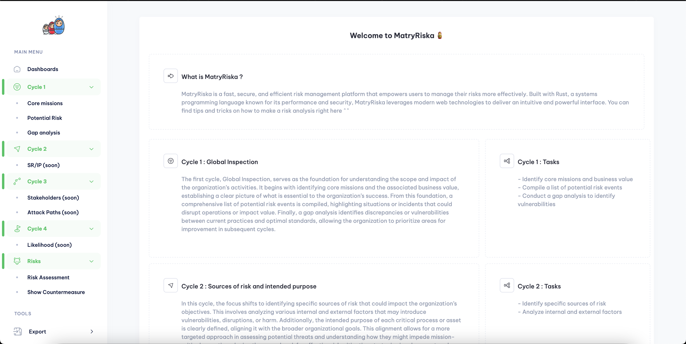

# MatryRiska 🪆

MatryRiska – Where you can manage your risk and make it more manageable.


## Table of Contents

- [About](#about)
- [Features](#features)
- [Getting Started](#getting-started)
- [Usage](#usage)
- [Contributors](#contributors)

## About
MatryRiska is a fast, secure, and efficient risk management platform that empowers users to manage their risks more effectively. Built with Rust, a systems programming language known for its performance and security, MatryRiska leverages modern web technologies to deliver an intuitive and powerful interface.

## Features
Key Features:

- Speed and Security: Developed in Rust, ensuring a highly performant and secure platform.
- Web-Based: Accessible from any modern browser, enabling seamless interaction with risk data.
- Docker Support: Fully containerized with Docker, making deployment and scaling straightforward and efficient.

<details open>
<summary>See previews 📸</summary>
<br>

You Can go here <a href="https://github.com/Sn0wAlice/MatryRiska/wiki/Page-preview">Click here for more preview</a>



</details>

## Getting Started

You can run the applicaiton using either docker or cargo. But we strongly recommend using **docker** for the ease of use.

### 1. Using docker
```bash
wget https://raw.githubusercontent.com/Sn0wAlice/MatryRiska/refs/heads/main/docker-compose.yml
docker-compose up
```

(arm64) please use cargo

### 2. Using cargo
```bash
## Step 1: configure mysql db somewhere
# [...]

## Step 2: run the server
git clone https://github.com/Sn0wAlice/MatryRiska
cd MatryRiska
cargo run
```


## Usage
When the app is up: go on `http://localhost:8080` and that's it!

You wan't to add a new functionality? Feel free to open a [issue](https://github.com/Sn0wAlice/MatryRiska/issues) or a pull request!

## Configuration
With the docker file (and local install), you can see the `./config` folder. You can change the configuration by updating the `default.json` file. Don't forget to update the `docker-compose.yml` file to update the default configuration.

> Database configuration are also in the default.json file in the `./config` folder. You can change the database configuration by updating the `default.json` file. Don't forget to update the `docker-compose.yml` file to mount this folder if needed !

## Contributors
- [Sn0wAlice](https://github.com/Sn0wAlice)